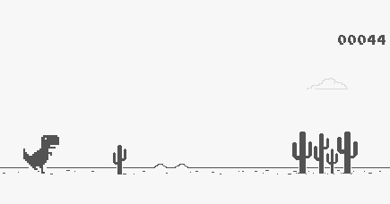

# T-Rex with motion

Play the game on [GitHub Pages](https://lukonik.github.io/t-rex-with-motion/).


## Intro
T-Rex with Motion is a famous T-Rex game with one addition: you jump using hand motion instead of pressing the spacebar. It uses [tensorflow-hand-pose-library](https://blog.tensorflow.org/2021/11/3D-handpose.html) under the hood to track hand movements. I used an existing T-Rex game repo for the gameplay, so huge thanks to the creator ([link](https://github.com/wayou/t-rex-runner))

## Gameplay actions
To jump, just move any of your index, middle, or ring fingers up and down. You can move all of them if you want. Remember to show your hand to the webcam so it can track your hand properly.

## Deployment

Pushes to `main` are automatically built and deployed by the [GitHub Pages workflow](.github/workflows/deploy-pages.yml). In the repository settings, set **Settings → Pages → Build and deployment → Source** to **GitHub Actions** once. The site will then be available at <https://lukonik.github.io/t-rex-with-motion/>.

To create the same production build locally, run:

```sh
npm run build:github-pages
```
